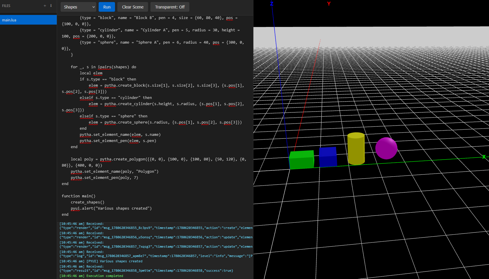
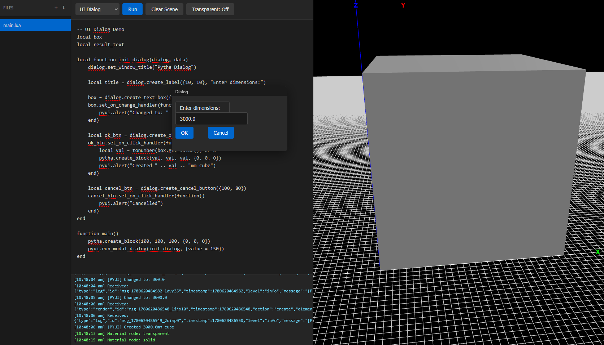

# Pytha Runtime

A browser-to-runtime Lua environment that executes Lua code via Fengari (Lua VM in JavaScript) and renders 3D geometry via Three.js.

## Architecture

```
┌────────────────────────────────────────────────────────────────────┐
│                          Client (Browser)                          │
│                                                                    │
│   ┌──────────────┐     ┌──────────────┐     ┌──────────────────┐   │
│   │  Lua Editor  │────►│  WS Client   │────►│  Three.js        │   │
│   │  (textarea)  │     │              │◄────│  Renderer        │   │
│   └──────────────┘     └──────────────┘     └──────────────────┘   │
│                              ▲                                     │
│                              │    Messages                         │
│                              │  (render,                           │
│                              │   ui_create,                        │
│                              │   ui_event, etc)                    │
│                              │                                     │
└──────────────────────────────┼─────────────────────────────────────┘
                               │                    
                    WebSocket  │                     
                    (ws://...) │                     
                               │                      
                               ▼                    
┌──────────────────────────────┼─────────────────────────────────────┐
│                         Runtime (Node.js)                          │
│                              │                                     │
│   ┌──────────────────────────┴───────────────────────────────────┐ │
│   │                    Fengari Lua VM                            │ │
│   │                                                              │ │
│   │   ┌─────────────────────────────────────────────────────────┐│ │
│   │   │  JS Closures (pytha.*, pyui.*, pyio.*, pygeo.*)         ││ │
│   │   │       │                    │                    │       ││ │ 
│   │   │       ▼                    ▼                    ▼       ││ │ 
│   │   │  emitRender()         emitUICreate()      emitLog()     ││ │
│   │   └─────────────────────────────────────────────────────────┘│ │
│   └──────────────────────────────────────────────────────────────┘ │
└────────────────────────────────────────────────────────────────────┘
```

**Message Flow:**

1. Client sends Lua code via WebSocket
2. Runtime passes code to Fengari Lua VM
3. Lua VM executes, calling JS closures (pytha.*, pyui.*, etc.)
4. JS closures send messages back to Runtime
5. Runtime broadcasts messages to Client
6. Three.js renders geometry / HTML UI shows dialogs

## Running

```bash
npm install
npm run dev:runtime # Start WebSocket runtime on port 8080
npm run dev:client   # Start Vite dev server on port 3000
```

Open `http://localhost:3000` to use the editor.

## Pytha Lua API

For full API documentation, see [Pytha Lua API Wiki](https://github.com/pytha-3d-cad/pytha-lua-api/wiki).

### Geometry Creation

```lua
local block = pytha.create_block(80, 60, 40, {0, 0, 0})
pytha.set_element_name(block, "Block A")

local cyl = pytha.create_cylinder(100, 30, {200, 0, 0})
pytha.set_element_name(cyl, "Cylinder A")

local sphere = pytha.create_sphere(40, {300, 0, 0})
pytha.set_element_name(sphere, "Sphere A")

local polygon = pytha.create_polygon({{0, 0}, {100, 0}, {100, 80}, {50, 120}, {0, 80}}, {400, 0, 0})
```



### UI Creation

```lua
local function init_dialog(dialog, data)
    dialog.set_window_title("My Dialog")

    local label = dialog.create_label({10, 10}, "Enter dimensions:")

    local text_box = dialog.create_text_box({10, 40}, tostring(data.value or 100))

    local ok_btn = dialog.create_ok_button({10, 80})
    ok_btn.set_on_click_handler(function()
        local val = tonumber(text_box.get_value()) or 0
        pytha.create_block(val, val, val, {0, 0, 0})
    end)

    local cancel_btn = dialog.create_cancel_button({100, 80})
end

pytha.create_block(100, 100, 100, {0, 0, 0})
pyui.run_modal_dialog(init_dialog, {value = 150})
```


